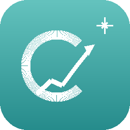

<div align="center">



# Crypto Scalper Scanner

**Professional-grade Binance spot scanner, signal engine, and live trading terminal — all in one desktop app.**

[](https://github.com/ZAKhan/crypto-scanner/releases/latest)
[](https://python.org)
[](https://pypi.org/project/PyQt6/)
[](LICENSE)
[](#installation)

</div>

---

## Overview

Crypto Scalper Scanner connects to Binance, scores every coin in the top 30 by volume using a multi-indicator confluence engine, and fires alerts the moment a setup forms — before the move. When you're ready to trade, it places a market BUY and OCO stop-loss in one click. Your SL lives on Binance's servers, so you're protected even if the app goes offline.

```
Scan → Score → Alert → Trade → Protect
```

---

## Highlights

| | Feature | Detail |
|---|---|---|
| ⚡ | **Live WebSocket prices** | Real-time feed from Binance — TP/SL detection in milliseconds |
| 📊 | **Multi-indicator scoring** | RSI · StochRSI · MACD · Bollinger Bands · ATR · S/R · Candlestick patterns |
| 🔮 | **PRE-BREAKOUT detection** | Fires before the spike — BB squeeze + volume surge + RSI + support confluence |
| 🛡 | **8-rule safety system** | BTC drop cooldown, trend freshness, per-symbol recovery gate, and more |
| 📋 | **Signal audit log** | Every scan logged to daily CSV — 22 columns, 7-day retention |
| 📈 | **Outcome tracking** | WIN/LOSS/FLAT recorded at 30min / 1h / 4h after every alert |
| 🏦 | **OCO protection** | Stop-loss lives on Binance — survives app crash, PC restart, internet drop |

---

## Signals

Signals are scored by confluence — the more indicators agree, the stronger the signal.

```
PRE-BREAKOUT  →  STRONG BUY  →  BUY  →  NEUTRAL  →  SELL  →  STRONG SELL
```

### ⚡ PRE-BREAKOUT
Early warning before a price spike. Fires when all four conditions align simultaneously:

- 📉 BB width `< 5%` — Bollinger Bands squeezed (price coiling)
- 📦 Volume `≥ 1.5×` average — unusual accumulation
- 📊 RSI between `35–55` — recovering, not overbought
- 📍 Price in bottom `25%` of BB range — sitting at support

---

## Trade Safety System

Eight rules run before every trade. Each is individually toggleable in **Config → Trade Safety**.

| Rule | Default | Trigger |
|---|---|---|
| Signal persistence | ✅ On | Signal must hold across 2+ consecutive scans |
| BTC trend check | ✅ On | Block if BTC dropping > 2% |
| BTC drop cooldown | ✅ On | Block new LONGs for 60 min after BTC drops; lifts on 1.5% recovery |
| 1h trend freshness | ✅ On | Override stale `trend_1h='up'` if price already fell > 1.5% below 1h open |
| Per-symbol recovery gate | ✅ On | Require 1% bounce after a safety block fires (max 30 min lock) |
| Coin trend check | ✅ On | Skip if coin is down > 5% in 24h |
| Max open trades | ✅ On | Hard cap of 3 concurrent trades |
| Daily loss limit | ✅ On | Halt trading if losses exceed $100 |

When a rule blocks a trade, a dialog explains exactly why — with an override option if you disagree.

---

## How a trade executes

```
1  Scanner fires STRONG BUY or PRE-BREAKOUT
2  All 8 safety rules pass
3  Right-click row → BUY {coin}
4  Trade dialog — set size, SL%, TP%
5  Confirm → Market BUY placed on Binance
6  OCO placed automatically (TP limit + SL stop-market)
7  WebSocket detects TP/SL hit in milliseconds
8  Market SELL + OCO cancel fired instantly
```

> **OCO protection:** Your stop-loss order lives on Binance's servers. If the app crashes, your PC restarts, or your internet drops — Binance will still execute the stop-loss automatically.

---

## Installation

**Requirements:** Python 3.10+ · Linux / Windows / macOS

```bash
pip install PyQt6 requests websocket-client
python crypto_scanner.py
```

### First-time setup

1. Open **Config → Binance API** → paste your API key and secret
2. Leave **Testnet Mode** on while familiarising yourself
3. Click **Test Connection → Apply Settings**
4. Scanner starts automatically — signals appear within the first scan

> ⚠️ For live trading: grant **TRADE + USER_DATA** permissions only. Never enable withdrawals.

### Testnet setup

Create free testnet keys at [testnet.binance.vision](https://testnet.binance.vision) (GitHub login). Fund with testnet USDT using the built-in refill script.

---

## Architecture

`crypto_scanner.py` is the entry point. All logic lives in the `cs/` package:

| Module | Role |
|---|---|
| `cs/config.py` | Version, paths, `CFG` / scan settings |
| `cs/api.py` | Binance REST helpers, `TRADING_CFG` |
| `cs/indicators.py` | RSI · MACD · Bollinger · StochRSI · patterns · `analyse()` |
| `cs/trader.py` | `BinanceTrader` — all order operations (BUY, OCO, SELL) |
| `cs/scanner.py` | `Scanner` / `ScanWorker` — manual scan thread |
| `cs/alerts.py` | `AlertEngine` · `OutcomeTracker` — auto-scan and WIN/LOSS tracking |
| `cs/safety.py` | `check_trade_safety()` — 8-rule safety gate |
| `cs/sounds.py` | Pure-Python WAV alert sounds |
| `cs/logger.py` | Signal audit CSV log |
| `cs/surge.py` | `VolumeSurgeDetector` |
| `cs/updater.py` | GitHub version checker |
| `cs/stylesheet.py` | Qt6 dark theme stylesheet |
| `cs/widgets.py` | Custom Qt widgets (sparklines, badges, charts, detail panel) |
| `cs/websocket_feed.py` | `BinanceWebSocketPrices` — real-time price feed |
| `cs/main_window.py` | `CryptoScannerWindow` — main UI |

---

## Data directory

Created automatically on first launch:

| OS | Path |
|---|---|
| Linux | `~/.config/CryptoScalper/` |
| Windows | `%APPDATA%\CryptoScalper\` |
| macOS | `~/Library/Application Support/CryptoScalper/` |

Signal logs rotate daily and are automatically deleted after 7 days. Open today's log from **Config → Open Signal Log**.

---

## Documentation

| | |
|---|---|
| 📖 [Tutorial](tutorial.html) | Step-by-step walkthrough with screenshots |
| 📘 [Full Guide](crypto_scanner_guide.odt) | Complete reference — all settings, indicators, and workflows |
| 📝 [Release Notes](https://github.com/ZAKhan/crypto-scanner/releases) | Per-version changelog |

---

<div align="center">

Made in Karachi &nbsp;·&nbsp; Binance Spot API + WebSocket &nbsp;·&nbsp; PyQt6

</div>
